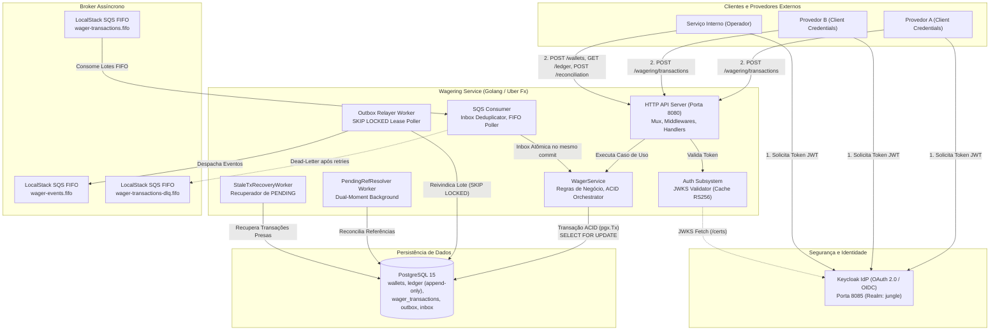
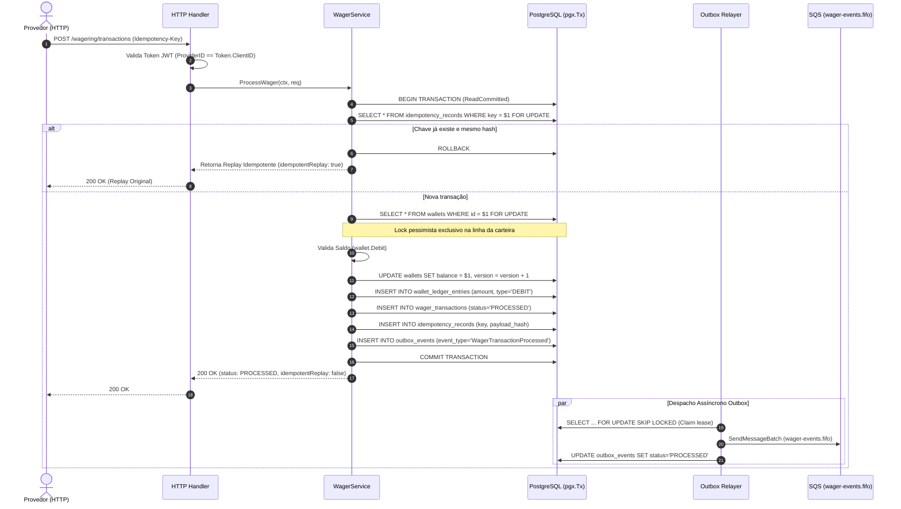
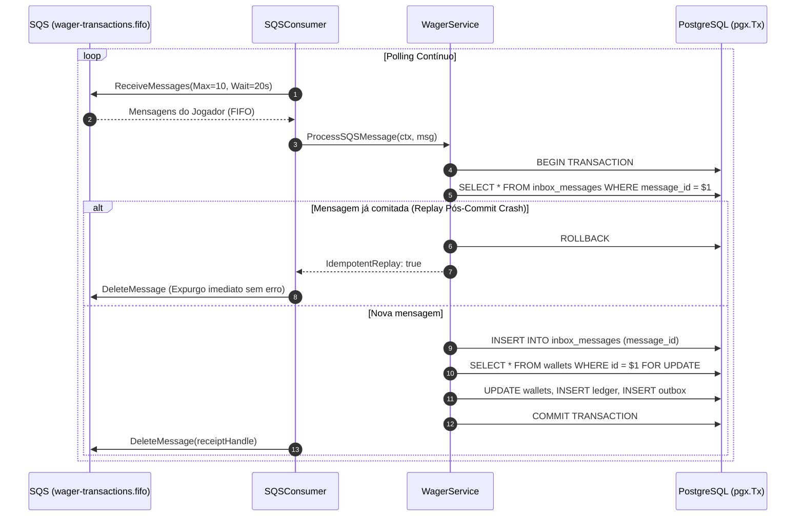
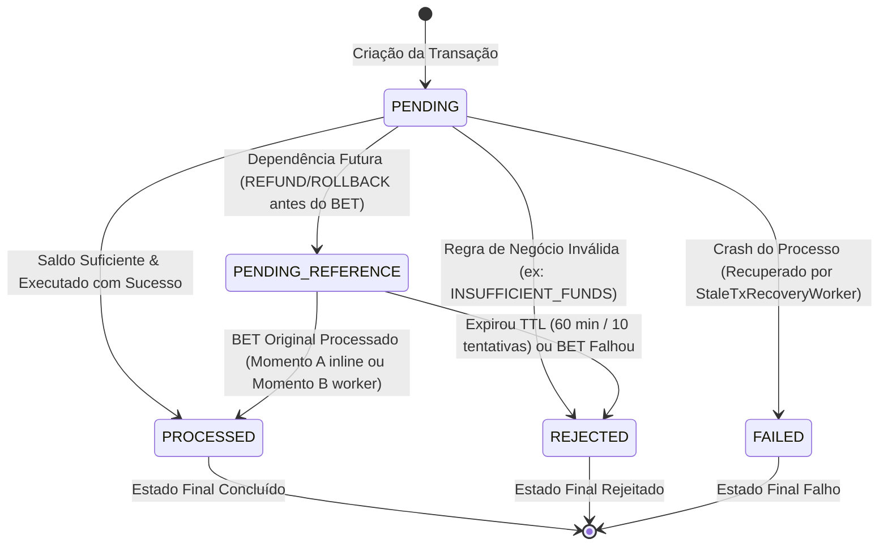
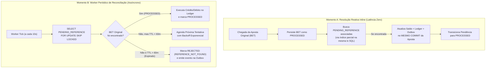

# Arquitetura — Jungle Gaming Backend Challenge

## 1. Visão Geral
Serviço distribuído de movimentação financeira e wagering em conformidade com o desafio de backend da Jungle Gaming.

---

## 2. Invariantes Arquiteturais (Cross-Phase Invariants)
1. **Money sem Float & Limites Numéricos:** Valores monetários são manipulados rigorosamente em centavos inteiros (`int64`), utilizando o Value Object de domínio `money.Money`. O uso de números de ponto flutuante (`float32` ou `float64`) é estritamente proibido em qualquer camada da aplicação. O teto máximo representável é `math.MaxInt64` centavos (aproximadamente R$ 92 quadrilhões), e operações aritméticas (`Add`, `Sub`) validam proativamente limites numéricos para impedir overflow e underflow aritmético silencioso.
2. **Outbox Post-Commit:** Registros do Transactional Outbox são gerados na mesma transação SQL da mutação financeira e a publicação/despacho externo só ocorre após o commit confirmado no banco de dados.
3. **Ledger Append-Only:** A tabela `wallet_ledger_entries` é estritamente append-only. Nunca executar `UPDATE` ou `DELETE` em lançamentos do ledger (garantido por trigger de imutabilidade no PostgreSQL `trg_protect_wallet_ledger_entries`).
4. **Idempotent Replay é Consulta:** O replay idempotente consulta o resultado originalmente persistido e o devolve (`idempotentReplay: true`), sem reprocessar regras de negócio, sem debitar/creditar saldo e sem gerar novas entradas de ledger.
5. **Isolamento de Lock por Carteira:** A coordenação de concorrência é granular por carteira (`wallet_id`). O lock em uma carteira nunca deve bloquear ou degradar requisições para carteiras diferentes.

---

## 3. Estratégia de Concorrência, Transações SQL e Integridade Financeira
- **Delimitação da Transação SQL (ACID Estrito):** O ciclo de vida da transação utiliza `pgxpool.Pool` do driver `pgx/v5` sob o nível de isolamento `ReadCommitted`. A coordenação atômica no `WagerService` abrange, sob o mesmo bloco `pgx.Tx`:
  1. Lock pessimista da carteira (`SELECT ... WHERE id = $1 FOR UPDATE`).
  2. Validação e débito/crédito do saldo em memória (`wallet.Debit` / `wallet.Credit`).
  3. Atualização do saldo e incremento da versão na tabela `wallets`.
  4. Inserção do lançamento imutável na tabela `wallet_ledger_entries` (em centavos).
  5. Inserção do registro da transação de aposta na tabela `wager_transactions`.
  6. Inserção do registro de idempotência com hash SHA-256 canônico na tabela `idempotency_records`.
  7. Inserção do evento de integração na tabela `outbox_events`.
  8. Inserção da confirmação na tabela `inbox_messages` (em fluxos via mensageria SQS).
- **Locking Granular por Linha:** As transações financeiras adquirem lock pessimista exclusivamente na linha da carteira alvo (`FOR UPDATE`). Não existe lock de tabela ou trava global em memória, assegurando paralelismo total e vazão máxima para operações em carteiras distintas.
- **Prevenção de Lost Updates e Deadlocks:** Como cada requisição financeira bloqueia uma única carteira por vez, o risco de deadlocks circulares entre transações é nulo. Caso duas requisições disputem a mesma carteira, o PostgreSQL enfileira a segunda transação de forma determinística; a segunda transação lê o saldo atualizado e a nova versão comitada pela primeira.
- **Defesa em Profundidade com Optimistic Lock Check:** A cláusula de atualização `UPDATE wallets SET balance = $1, version = version + 1 WHERE id = $2 AND version = $3` atua como salvaguarda adicional de consistência.

---

## 4. Contrato de Resposta HTTP (`POST /wagering/transactions`)

| Cenário | HTTP Status | Corpo / Envelope de Resposta | Descrição |
| --- | --- | --- | --- |
| **Sucesso (`PROCESSED`)** | `200 OK` | `{"transactionId": "...", "status": "PROCESSED", "balance": {"amount": "...", "currency": "..."}, "idempotentReplay": false}` | Aposta/ganho executado com sucesso e saldo atualizado. |
| **Rejeição de Negócio (`REJECTED`)** | `200 OK` | `{"transactionId": "...", "status": "REJECTED", "balance": {"amount": "...", "currency": "..."}, "idempotentReplay": false}` | Decisão de negócio válida (ex: saldo insuficiente). A transação é registrada para auditoria, sem debitar saldo e sem criar ledger. |
| **Replay Idempotente** | `200 OK` | Envelope idêntico ao original persistido, com `"idempotentReplay": true` | Mesma chave de idempotência e payload idêntico. Retorna o resultado exato original. |
| **Entrada Inválida** | `400 Bad Request` | `{"error": "..."}` | Payload malformado, falta de header `Idempotency-Key`, `walletId` ausente ou formato de moeda inválido. |
| **Conflito de Idempotência** | `409 Conflict` | `{"error": "idempotency key conflict: ..."}` | Chave de idempotência reutilizada com payload de negócio divergente, ou `(providerId, externalTransactionId)` duplicado sob outra chave. |
| **Processamento Pendente** | `202 Accepted` | `{"transactionId": "...", "status": "PENDING_REFERENCE", ...}` | Operação depende de referência ainda não chegada (Fase 8). |
| **Indisponibilidade Transitória** | `503 Service Unavailable` ou `500 Internal Server Error` | `{"error": "..."}` | Falhas de conexão temporária de banco ou rede antes de estabelecer transação. |

---

## 5. Transações e Gerenciamento de Conexões
- As transações SQL (`pgx.Tx`) são abertas e comitadas explicitamente no `WagerService`.
- Toda mutação (carteira, transação de aposta, ledger e registro de idempotência) ocorre dentro do mesmo bloco atômico.
- Caso ocorra violação de unicidade de chave concorrente (`23505`), o serviço executa rollback imediato da transação atual, consulta o registro gravado pelo processo concorrente vencedor e retorna o replay de forma transparente.

---

## 6. Transactional Outbox Pattern e Relayer Multi-Publisher

### 6.1. Garantia de Atomicidade e Invariante Post-Commit
- Todo evento de integração (`WagerTransactionProcessed`, `WagerTransactionRejected`, `WalletBalanceChanged`, `WagerTransactionPendingReference`) é gerado no domínio e persistido na tabela `outbox_events` rigorosamente dentro da **mesma transação SQL** (`pgx.Tx`) que atualiza a carteira, gera a entrada append-only no ledger e persiste o registro de idempotência.
- Se a transação sofrer `ROLLBACK`, absolutamente nenhum registro de outbox é gravado, eliminando mensagens-fantasma.
- A publicação externa nunca ocorre dentro da transação HTTP/SQL: é sempre delegada ao background worker `OutboxRelayer`, que despacha eventos exclusivamente após o commit bem-sucedido no banco de dados.

### 6.2. Estrutura do Envelope e Imutabilidade dos Eventos
O envelope do evento segue estritamente as diretrizes da Seção 11 da especificação:
- `eventId`: UUID v4 estável gerado na emissão do evento. Mantém-se imutável em qualquer republicação ou recuperação de falha.
- `eventType`: Nome do evento (`WagerTransactionProcessed`, `WagerTransactionRejected`, `WalletBalanceChanged`, `WagerTransactionPendingReference`).
- `aggregateId`: Identificador do agregado raiz (`walletId` para `WalletBalanceChanged` ou `transactionId` para transações de aposta).
- `correlationId`: Mapeado para o header `Idempotency-Key` da requisição HTTP (ou `messageId` do SQS na Fase 7). Para aberturas internas sem chave externa, adota o ID da transação.
- `causationId`: Permanece `nil` nesta Fase 6, pois as ações derivam de chamadas primárias de API. Fica reservado para eventos desencadeados por outros eventos (ex: resolução de referências na Fase 8).
- `occurredAt`: Timestamp no padrão UTC RFC 3339 Nano (`time.RFC3339Nano`).
- `version`: Inteiro tipado (versão 1 do schema de evento).
- `data`: Snapshot JSONB imutável contendo os dados concretos da operação, com valores monetários expressos em strings decimais formatadas (ex: `"100.00"`, `"0.00"`).

### 6.3. Disputa Multi-Publisher via `SELECT ... FOR UPDATE SKIP LOCKED`
Para viabilizar escala horizontal sem duplicação de mensagens e sem deadlocks:
- O relayer consulta os registros pendentes através de uma CTE atômica:
  ```sql
  WITH claimed AS (
      SELECT id
      FROM outbox_events
      WHERE status = 'PENDING'
        AND next_attempt_at <= NOW()
        AND (locked_until IS NULL OR locked_until < NOW())
      ORDER BY created_at ASC
      LIMIT $1
      FOR UPDATE SKIP LOCKED
  )
  UPDATE outbox_events o
  SET locked_until = NOW() + ($2 || ' seconds')::interval,
      retry_count = retry_count + 1
  FROM claimed
  WHERE o.id = claimed.id
  RETURNING o.id, o.aggregate_type, o.aggregate_id, o.event_type, o.payload, o.status,
            o.retry_count, o.next_attempt_at, o.locked_until, o.last_error, o.created_at, o.processed_at;
  ```
- O uso de `SKIP LOCKED` assegura que N workers em execução simultânea não bloqueiem uns aos outros e nunca reivindiquem o mesmo registro.

### 6.4. Recuperação de Trabalho Abandonado e Backoff Exponencial
- **Recuperação de Crash**: Cada reivindicação define uma locação temporal (`locked_until = NOW() + leaseDuration`). Se o worker que reivindicou um lote sofrer falha de hardware, restart do pod ou interrupção de rede antes de confirmar, o lease expira e outro publisher assume o processamento do evento mantendo seu `eventId` inalterado.
- **Backoff Exponencial com Jitter/Capping**: Em caso de falha no publisher, o próximo envio é agendado via `next_attempt_at = NOW() + baseBackoff * 2^(retry_count-1)` (limitado a `maxBackoff`).
- **Terminalidade `FAILED`**: Ao atingir `maxRetries` tentativas sem sucesso, o status transiciona para `FAILED` para fins de auditoria e inspeção de DLQ.

### 6.5. Observabilidade e Lag da Outbox
- O método `GetLag` da camada de persistência expõe o total de eventos pendentes (`pendingCount`) e a idade do evento mais antigo aguardando despacho (`oldestPendingAge`), provendo a métrica de "atraso da outbox" exigida pela Seção 12 da especificação do desafio.

---

## 7. Mensageria Assíncrona AWS SQS e Padrão Inbox

### 7.1. Topologia de Filas e Configurações SQS FIFO
O serviço integra com a infraestrutura AWS SQS (LocalStack local e AWS em produção) provisionando automaticamente as seguintes filas FIFO:
1. `wager-transactions.fifo`: Fila principal de entrada de requisições de apostas assíncronas (`WagerTransactionRequested`). Configurada com `FifoQueue: true`, `ContentBasedDeduplication: false` e `RedrivePolicy` apontando para a DLQ com `maxReceiveCount: 5`.
2. `wager-transactions-dlq.fifo`: Fila de Dead Letter (DLQ) FIFO para retenção e quarentena de mensagens envenenadas ou erros permanentes após esgotamento de tentativas.
3. `wager-events.fifo`: Fila de saída FIFO para onde o `OutboxRelayer` despacha os eventos transacionais de integração gerados pelo sistema (`WagerTransactionProcessed`, `WagerTransactionRejected`, `WalletBalanceChanged`, `WagerTransactionPendingReference`).

### 7.2. Semântica de Particionamento e Deduplicação Broker-Level
- `MessageGroupId`: Mapeado para o `playerId` (ou `aggregateId` na saída), garantindo preservação estrita de ordem sequencial por jogador/carteira, ao mesmo tempo em que permite consumo concorrente paralelo entre jogadores distintos.
- `MessageDeduplicationId`: Na publicação de saída da Outbox, é atribuído o `eventId` imutável. Na entrada, o envelope porta o `messageId` durável.

### 7.3. Padrão Inbox e Atomicidade Transacional
- Toda mensagem recebida é registrada na tabela `inbox_messages` (`id`, `message_id`, `consumer_name`, `source`, `payload_hash`, `received_at`, `processed_at`) rigorosamente dentro da **mesma transação SQL** (`pgx.Tx`) que atualiza a carteira (`wallets`), insere o registro da aposta (`wager_transactions`), gera a entrada append-only no ledger (`wallet_ledger_entries`) e enfileira os eventos da Outbox (`outbox_events`).
- Se houver falha ou rollback durante a execução, nada é comitado e a mensagem não entra na Inbox, permitindo retry natural pelo broker.

### 7.4. Interrupção Pós-Commit e Reentrega Segura (Item 5 da Seção 13 do Desafio)
- Se a instância sofrer interrupção após o commit bem-sucedido no PostgreSQL, mas antes da chamada a `sqs.DeleteMessage`, a mensagem será reentregue pelo SQS após o vencimento do `VisibilityTimeout`.
- Ao receber a mensagem reentregue, o consumidor consulta a Inbox. Como o registro já foi comitado, o caso de uso detecta `IdempotentReplay: true`.
- O consumidor **não retorna erro** e executa imediatamente a chamada `sqs.DeleteMessage(ctx, queueURL, receiptHandle)`, expurgando a duplicata da fila de forma silenciosa e idempotente, sem degradar métricas nem reenviar para DLQ.

### 7.5. Mensagens com Dependência Futura (`PENDING_REFERENCE`)
- Conforme as Seções 6.3, 6.5 e 10 do Desafio, quando uma mensagem de `REFUND` ou `ROLLBACK` chega antes da aposta original, ela é persistida com status `PENDING_REFERENCE` e o evento `WagerTransactionPendingReference` é gravado na Outbox, confirmando a Inbox na mesma transação atômica.
- O consumidor SQS considera o registro `PENDING_REFERENCE` como um processamento com sucesso no broker e remove a mensagem da fila (`sqs.DeleteMessage`), liberando a partição FIFO e delegando a reconciliação assíncrona ao worker de resolução de referências (Fase 8).

### 7.6. Rejeições de Negócio Terminais
- Rejeições de negócio confirmadas (ex: saldo insuficiente para uma aposta) são decisões válidas e finais. O registro é persistido com status `REJECTED`, evento `WagerTransactionRejected` é emitido na Outbox e a mensagem é removida do broker (`sqs.DeleteMessage`), impedindo loops desnecessários e evitando poluição da DLQ com regras de negócio esperadas.

### 7.7. Graceful Shutdown e Liberação Imediata de Visibilidade (0s)
- Em sinal de desligamento (`SIGTERM` / `Stop`), o consumidor encerra o polling cancelando o contexto do leitor e aguarda as mensagens em voo finalizarem até o prazo do shutdown.
- Se o prazo limite for atingido com mensagens ainda não comitadas, o consumidor aciona `sqs.ChangeMessageVisibility` com `VisibilityTimeout: 0` para cada mensagem pendente em voo.
- As mensagens são imediatamente liberadas de volta ao broker para redistribuição instantânea por outros pods/instâncias, sem reter os 30 segundos do visibility timeout padrão. Caso a goroutine retardada termine após a liberação, ela ignora a deleção (`Skipping delete for message whose visibility was released to 0s`), preservando a integridade da fila.

---

## 8. Resolução de Referências Pendentes e Endpoints de Consulta (Seções 7 e 9 do Desafio)

### 8.1. Padrão de Resolução em Dois Momentos (Dual-Moment Resolution)
Em conformidade com as Seções 6.3, 6.5 e 7 do desafio, transações de `REFUND` e `ROLLBACK` podem chegar fora de ordem (antes da aposta original). O sistema emprega um padrão de resolução em dois momentos para garantir latência mínima e conciliação eventual infalível:

1. **Momento A (Resolução Inline Reativa)**:
   - Ao processar uma transação original (`BET`/`WIN`) via SQS ou HTTP, imediatamente após persistir a transação principal, o `WagerService` busca transações em `PENDING_REFERENCE` que apontem para aquele `(provider_id, external_id)` utilizando o índice parcial `idx_wager_tx_pending_ref`.
   - Se encontradas, a resolução é executada **dentro da mesma transação SQL (`pgx.Tx`)** do evento principal. O saldo da carteira é ajustado, o ledger append-only é gravado, a transação pendente transiciona para `PROCESSED` e os eventos de outbox correspondentes (`WagerTransactionProcessed`, `WalletBalanceChanged`) são gerados atomicamente.
   - **Garantia de latência zero**: Não depende de espera do worker de reconciliação em lote.

2. **Momento B (Worker Periódico de Reconciliação — `PendingRefResolver`)**:
   - Um worker em background varre periodicamente (default: a cada 10s) a tabela `wager_transactions` buscando registros `PENDING_REFERENCE` elegíveis para retry (`next_attempt_at <= NOW()`).
   - Através de uma query com `LEFT JOIN`, o worker verifica se o `BET`/`WIN` original já foi processado ou se a pendência atingiu o limite de expiração (TTL de 60 minutos ou 10 tentativas).
   - Utiliza `FOR UPDATE SKIP LOCKED` para permitir execução concorrente e coordenada entre múltiplas réplicas da aplicação sem bloqueios mútuos e sem risco de deadlocks (`40P01`).

### 8.2. Matriz de Direção Financeira e Guardas de Negócio
A reconciliação financeira de referências pendentes obedece à semântica estrita do desafio:

| Transação Pendente | Transação Original Referenciada | Direção Financeira | Validações e Códigos de Erro Estáveis |
|---|---|---|---|
| `REFUND` | `BET` (PROCESSED) | **CREDIT** (Crédito) | Se já reembolsado anteriormente → `ALREADY_REFUNDED`. Se BET original falhou (`REJECTED`/`FAILED`) → `ORIGINAL_TRANSACTION_FAILED`. |
| `ROLLBACK` | `BET` (PROCESSED) | **CREDIT** (Crédito) | Devolve o valor apostado. Se já revertido → `ALREADY_ROLLED_BACK`. Se BET falhou → `ORIGINAL_TRANSACTION_FAILED`. |
| `ROLLBACK` | `WIN` (PROCESSED) | **DEBIT** (Débito) | Estorna prêmio pago indevidamente. Valida saldo disponível: se insuficiente → `INSUFFICIENT_FUNDS_FOR_ROLLBACK`. Se já revertido → `ALREADY_ROLLED_BACK`. |
| `REFUND` / `ROLLBACK` | Não encontrada (TTL > 60m ou > 10 tentativas) | **NENHUMA** | Transiciona para `REJECTED` com `failureCode: REFERENCE_NOT_FOUND` e emite `WagerTransactionRejected` na Outbox. |

### 8.3. Backoff Exponencial e Fim de Vida do Limbo (TTL)
Para garantir que nenhuma mensagem permaneça indefinidamente em `PENDING_REFERENCE`:
- **Backoff Exponencial**: A cada rodada sem a chegada da transação referenciada, o worker incrementa `attempts` e agenda `next_attempt_at = NOW() + min(2^attempts, 300s)`.
- **Expiração por TTL**: Ao ultrapassar 60 minutos desde a criação (`created_at <= NOW() - 60 minutes`) ou 10 tentativas, a pendência é formalmente rejeitada como falha definitiva (`REFERENCE_NOT_FOUND`), liberando recursos e emitindo evento outbox para conhecimento externo.

### 8.4. Endpoints de Consulta HTTP (Seção 9 do Edital Oficial)
Para auditoria e integração dos operadores, o sistema provê endpoints de leitura otimizados:

1. **`GET /wallets/{walletId}`**:
   - Retorna o saldo corrente da carteira, moeda, jogador e a versão atual de concorrência (`version`). Retorna `404 Not Found` se não existir.

2. **`GET /wallets/{walletId}/ledger?limit=20&cursor=...` (Paginação Keyset com Cursor Opaco)**:
   - Paginação baseada em chaves (`(created_at, id)`) que elimina problemas de performance e inconsistência de `OFFSET`.
   - O cursor é serializado em Base64 opaco (`EncodeCursor` / `DecodeCursor`).
   - Retorna `entries` ordenadas decrescentemente por data/ID e `nextCursor` (string ou `null` quando for a última página). Parâmetro `limit` com padrão 20 e teto de 100 itens. Retorna `400 Bad Request` para cursor inválido ou corrompido.

3. **`GET /wagering/transactions/{transactionId}`**:
   - Consulta pelo UUID interno da transação. Retorna o snapshot completo incluindo `status`, `amount`, `origin`, `referenceId`, `externalTransactionId` e `failureCode` (se rejeitada).

4. **`GET /providers/{providerId}/wagering/transactions/{externalTransactionId}`**:
   - Rota hierárquica estritamente em conformidade com o edital da Seção 9 (sem query params), suportada nativamente pelo multiplexador HTTP do Go 1.22+.

---

## 9. Autenticação, Autorização e Identidade OAuth 2.0 / OIDC (Seções 2, 9, 13 e 14)

### 9.1. Justificativa da Escolha do IdP (Keycloak)
Conforme exigido na Seção 2 do edital, autenticação e autorização são mandatórias e integradas a um IdP externo OAuth 2.0/OIDC. A escolha do **Keycloak** baseia-se em:
- **Padrão de Mercado OIDC/OAuth 2.0**: Solução open source consolidada, mantida pela Red Hat/CNCF, que implementa integralmente os protocolos OpenID Connect Core 1.0 e OAuth 2.0 RFC 6749.
- **Suporte Nativo a Machine-to-Machine (`client_credentials`)**: O fluxo ideal para comunicação inter-serviços e integração de provedores terceiros de jogos, eliminando armazenamento e manipulação de senhas de usuários humanos no escopo do sistema de carteira.
- **Assinatura Assimétrica RS256 e Descoberta JWKS**: Tokens JWT são assinados assimetricamente pela chave privada do Keycloak. Os serviços consumidores validam a autenticidade e integridade das assinaturas consultando o endpoint público de certificados JWKS (`/protocol/openid-connect/certs`), garantindo validação descentralizada, de altíssima performance e sem chamadas síncronas de introspecção a cada requisição.
- **Portabilidade no Docker Compose**: O Keycloak inicializa em container leve (`quay.io/keycloak/keycloak:24.0.5`) com importação declarativa e versionada do realm `jungle` (`./keycloak/realm-export.json`), viabilizando testes de integração automatizados ponta-a-ponta **sem a utilização de mocks**, em total conformidade com o critério eliminatório das Seções 13 e 14.

### 9.2. Validação Criptográfica JWKS e Caching em Memória
A camada de autenticação ([`pkg/auth/validator.go`](file:///home/moa-dev/projetos/jungletest/pkg/auth/validator.go)) implementa validação em memória de alto desempenho:
1. **Cache Thread-Safe**: As chaves públicas RSA (`*rsa.PublicKey`) são decodificadas a partir dos módulos (`n`) e expoentes (`e`) do JWKS e armazenadas em mapa protegido por `sync.RWMutex`.
2. **Rotação de Chaves Resiliente**: Caso um token apresente um `kid` não mapeado em cache, o validador realiza refresh dinâmico controlado por rate-limit (máximo 1 refresh a cada 2 segundos), permitindo rotação de chaves criptográficas sem indisponibilidade ou restart da aplicação.
3. **Validação de Claims**:
   - Algoritmo obrigatório: `RS256`.
   - Expiração temporal: `exp` validado contra o relógio do sistema.
   - Emissor flexível: O claim `iss` é verificado contra o sufixo `/realms/<KeycloakRealm>` e a URL base configurada via variável de ambiente (`KEYCLOAK_URL`), suportando comunicação tanto via host (`localhost:8085`) quanto via rede interna de containers (`keycloak:8080`).
   - Identidade: O cliente autenticado é extraído preferencialmente de `azp` (Authorized Party) ou `client_id`.

### 9.3. Modelo de Autorização e Isolamento por Provedor (`providerId`)
O modelo de controle de acesso adota isolamento estrito com base na identidade autenticada no token JWT:
1. **Serviço Interno (`internal-service`)**:
   - Possui privilégio administrativo exclusivo para operações de carteira (`POST /wallets`, `GET /wallets/{walletId}`, `GET /wallets/{walletId}/ledger`).
   - Pode consultar transações de qualquer provedor para fins de reconciliação e auditoria global.
2. **Provedores de Jogos Externos (`provider-a`, `provider-b`, ...)**:
   - **Bloqueio Total de Carteira**: Tentativas de provedores de acessar rotas de abertura ou inspeção direta de carteiras são barradas no middleware com **`403 Forbidden`**.
   - **Isolamento de Operações de Apostas**: Ao submeter transações (`POST /wagering/transactions`), o `req.ProviderID` deve corresponder obrigatoriamente ao `ClientID` autenticado. Tentativas de operar em nome de outro provedor resultam em **`403 Forbidden`**.
   - **Isolamento de Consultas**: Endpoints de leitura (`GET /providers/:providerId/...` e `GET /wagering/transactions/:id`) restringem a resposta apenas às transações pertencentes ao provedor autenticado.

### 9.4. Proteção Contra Replay Cruzado de Idempotência (Seção 2)
O edital define: *"Provedores acessam apenas suas próprias transações, inclusive em replays..."*. A aplicação implementa defesa em profundidade em dois níveis:
1. **Validação Antecipada no Handler HTTP**: Antes de qualquer acesso ao banco de dados ou verificação de chaves de idempotência, o handler valida que `authCtx.ProviderID == req.ProviderID`.
2. **Guarda de Replay Cruzado no Banco de Dados**: Caso uma chave de idempotência (`Idempotency-Key`) enviada por `provider-b` colida com uma transação já persistida originada pelo `provider-a`, o serviço detecta a divergência do provedor proprietário original através de busca indexada (`GetByIdempotencyKey`) e retorna o erro sentinela `domain.ErrCrossProviderReplay`, mapeado pelo handler diretamente para **`403 Forbidden`**. Sob nenhuma circunstância a aplicação devolve o replay ou dados de apostas de terceiros.

### 9.5. Matriz de Controle de Acesso por Endpoint HTTP

| Endpoint | Método | Identidade Permitida | Sem Token | Token Inválido / Expirado | Provedor Incorreto |
|---|:---:|:---:|:---:|:---:|:---:|
| `/health/live` | `GET` | Público (Bypass) | `200 OK` | `200 OK` | `200 OK` |
| `/health/ready` | `GET` | Público (Bypass) | `200 OK` | `200 OK` | `200 OK` |
| `/wallets` | `POST` | `internal-service` | `401 Unauthorized` | `401 Unauthorized` | `403 Forbidden` |
| `/wallets/{walletId}` | `GET` | `internal-service` | `401 Unauthorized` | `401 Unauthorized` | `403 Forbidden` |
| `/wallets/{walletId}/ledger` | `GET` | `internal-service` | `401 Unauthorized` | `401 Unauthorized` | `403 Forbidden` |
| `/wallets/{walletId}/reconciliation` | `POST` | `internal-service` | `401 Unauthorized` | `401 Unauthorized` | `403 Forbidden` |
| `/wagering/transactions` | `POST` | Provedor do Payload ou `internal-service` | `401 Unauthorized` | `401 Unauthorized` | `403 Forbidden` |
| `/wagering/transactions/{id}` | `GET` | Provedor Dono da Tx ou `internal-service` | `401 Unauthorized` | `401 Unauthorized` | `403 Forbidden` |
| `/providers/{providerId}/wagering/transactions/{extId}` | `GET` | Provedor do Path ou `internal-service` | `401 Unauthorized` | `401 Unauthorized` | `403 Forbidden` |
| `/metrics` | `GET` | Público (Bypass) | `200 OK` | `200 OK` | `200 OK` |

---

## 10. Reconciliação Financeira, Observabilidade e Recuperação de Pendências (Seções 9, 12 e 13)

### 10.1. Reconciliação Financeira e Invariante de Não-Mutação
A Seção 9 do edital prescreve o endpoint:
```http
POST /wallets/:walletId/reconciliation
```
1. **Reconstrução Atômica via Ledger**: O saldo da carteira é reconstruído somando todos os créditos e subtraindo todos os débitos históricos persistidos na tabela imutável `wallet_ledger_entries` através de agregação SQL em centavos (`int64`):
   ```sql
   SELECT 
       COALESCE(SUM(CASE WHEN type = 'CREDIT' THEN amount ELSE 0 END), 0) -
       COALESCE(SUM(CASE WHEN type = 'DEBIT' THEN amount ELSE 0 END), 0) AS calculated_balance,
       COUNT(*) AS checked_entries
   FROM wallet_ledger_entries
   WHERE wallet_id = $1
   ```
2. **Visão Consistente no Banco de Dados**: A leitura do saldo armazenado (`wallet.Balance()`) e a reconstrução agregada do ledger ocorrem rigorosamente sob a mesma transação SQL (`pgx.Tx` com nível de isolamento `ReadCommitted`), eliminando anomalias de leituras fantasmas durante commits simultâneos de apostas.
3. **Precisão de Money sem Ponto Flutuante**: O cálculo da diferença:
   $$\text{difference} = \text{storedBalance} - \text{calculatedBalance}$$
   é executado exclusivamente através do método de domínio `storedBalance.Sub(calculatedBalance)` da struct `money.Money`. O valor da diferença mantém a mesma moeda ISO 4217 da carteira e respeita a restrição eliminatória absoluta contra ponto flutuante (`float32`/`float64`).
4. **Invariante Mandatório (Seção 9)**: A reconciliação **NUNCA altera o saldo da carteira**, mesmo em casos de divergência. Em vez de mutação forçada, a inconsistência é:
   - Reportada no payload HTTP (`"consistent": false, "difference": { ... }`).
   - Registrada com aviso nos logs estruturados JSON (`slog.WarnContext`).
   - Contabilizada no Prometheus através do incremento da métrica `reconciliation_divergences_total`.
5. **Isolamento de Acesso**: Endpoint restrito exclusivamente ao `internal-service` via middleware `auth.RequireInternal()`. Provedores externos de jogos recebem **`403 Forbidden`**.

### 10.2. Catálogo Operacional de Métricas Prometheus (`/metrics`)
Conforme a Seção 12 do edital, o endpoint público `/metrics` exporta métricas instrumentadas via `client_golang/prometheus` e `promauto`:
- `wager_transactions_total` (`CounterVec`, labels: `status`, `kind`, `provider`): volume e status de apostas processadas.
- `wager_duplicates_total` (`CounterVec`, labels: `origin`): tentativas de replay idempotente deduplicadas em HTTP e SQS.
- `sqs_retries_total` (`CounterVec`, labels: `queue`): número de retentativas de consumo de mensagens no SQS.
- `sqs_dlq_total` (`CounterVec`, labels: `queue`): volume de mensagens encaminhadas à fila de cartas mortas.
- `concurrency_conflicts_total` (`CounterVec`, labels: `type`): colisões de concorrência e optimistic lock.
- `outbox_lag_seconds` (`Gauge`): atraso em segundos entre criação na outbox e publicação efetiva no broker.
- `wager_processing_duration_seconds` (`HistogramVec`, labels: `kind`): latência de ponta a ponta na execução financeira.
- `reconciliation_divergences_total` (`Counter`): total de divergências detectadas pelo endpoint de reconciliação.

Todas as séries padrão são pré-inicializadas no bootstrap (`init()`) para que o scraping do Prometheus encontre todas as métricas ativas imediatamente, sem gerar estados de `No Data` em dashboards e alertas.

### 10.3. Health Checks Profundos (`/health/live` e `/health/ready`)
Os endpoints atendem à Seção 9 do edital:
- `GET /health/live`: Verifica a liveness básica do processo Go HTTP. Retorna `200 OK` com `{"status": "UP"}`.
- `GET /health/ready`: Executa validação ativa em tempo real dos componentes essenciais:
  - **PostgreSQL**: Executa `pool.Ping(ctx)`.
  - **SQS**: Executa `sqsClient.ListQueues(ctx, &sqs.ListQueuesInput{MaxResults: 1})`.
  - Se ambos estiverem operacionais, retorna `200 OK` com `{"status": "READY", "database": "UP", "sqs": "UP"}`. Caso qualquer dependência falhe, retorna `503 Service Unavailable` com `{"status": "DOWN", ...}`.

### 10.4. Recuperação de Transações Presas em PENDING (`StaleTxRecoveryWorker`)
Em conformidade com a Seção 13, item 8 e OBS-01 (*"Transações em PENDING: Devem possuir mecanismo de recuperação/timeout após interrupção abrupta de processo"*):
- O worker [`StaleTxRecoveryWorker`](file:///home/moa-dev/projetos/jungletest/pkg/service/stale_tx_recovery_worker.go) executa polling periódico (default: a cada 5s) identificando transações em `PENDING` que excederam o limiar de timeout (default: 30s) sem terem sido finalizadas devido a crash ou queda abrupta da aplicação.
- Utiliza **`FOR UPDATE SKIP LOCKED`** para coordenação segura em deploys concorrentes com múltiplas instâncias.
- **Resolução Segura**:
  - Se a transação já possuir lançamento no ledger (`wallet_ledger_entries`), significa que o débito/crédito ocorreu no banco mas a conexão caiu antes de atualizar o status; a transação é promovida com segurança para `PROCESSED`.
  - Se não houver lançamento no ledger, o processo crashou antes de efetivar o movimento na carteira; a transação é marcada como `FAILED` com `failureCode: "TRANSACTION_TIMEOUT"`, desbloqueando o ciclo de vida de forma atômica e consistente.
---

## 11. Composição Modular com Uber Fx & Ciclo de Vida Gracioso (Seção 13 do Edital)

### 11.1. Injeção de Dependência por Construtores
A aplicação adota o framework de injeção de dependências **Uber Fx** (`go.uber.org/fx`), eliminando o uso de variáveis globais, singletons descontrolados ou service locators:
- Cada componente expõe uma função construtora tipada (`New...`).
- O grafo de dependências é analisado em tempo de compilação/inicialização pelo Fx, validando a inexistência de ciclos de dependência antes de iniciar os listeners de rede.
- Os componentes são agrupados em módulos desacoplados por camada de responsabilidade:
  - `auth.Module`: Provedor do validador JWKS com cache em memória e middlewares HTTP.
  - `database.Module`: Provedor do pool de conexões PostgreSQL (`*pgxpool.Pool`).
  - `repository.Module`: Provedores dos repositórios de persistência (`WalletRepository`, `LedgerRepository`, `WagerTransactionRepository`, `IdempotencyRepository`, `OutboxRepository`, `InboxRepository`).
  - `messaging.Module`: Provedores do cliente AWS SQS v2, provisionador automático de filas FIFO e consumidor de mensagens.
  - `service.Module`: Provedores dos casos de uso de negócio (`WagerService`) e background workers (`OutboxRelayer`, `PendingRefResolver`, `StaleTxRecoveryWorker`).
  - `api.Module`: Provedores do roteador HTTP, handlers REST e servidor HTTP (`*http.Server`).

### 11.2. Orquestração Ordenada de Inicialização e Encerramento (`fx.Lifecycle`)
A coordenação de inicialização e desligamento gracioso atende ao requisito mandatório da Seção 13 (*"Adicione uma verificação da composição Fx e de seu início e encerramento, incluindo liberação de recursos dos workers"*):

```text
[Startup Sequence]
1. database.Module    -> Abre pool de conexões PostgreSQL (pgxpool)
2. messaging.Module   -> Provisiona filas SQS FIFO e inicia cliente AWS
3. service.Module     -> Registra workers de background (OutboxRelayer, PendingRefResolver, StaleTxRecoveryWorker)
4. messaging.Module   -> Inicia goroutines de consumo SQS (SQSConsumer)
5. api.Module         -> Inicia servidor HTTP (http.Server.ListenAndServe)
```

```text
[Graceful Shutdown Sequence (Ordem Reversa)]
1. api.Module         -> http.Server.Shutdown(ctx) rejeita novas conexões HTTP
2. messaging.Module   -> Cancela contexto do SQSConsumer, aguarda mensagens em voo e libera visibilidade para 0s
3. service.Module     -> Cancela contextos de background dos workers (OutboxRelayer, PendingRefResolver, StaleTxRecoveryWorker)
4. database.Module    -> Fecha graciosamente o pool de conexões (pgxpool.Close())
```

Essa sequência impede que goroutines de background tentem acessar o banco após o encerramento do pool de conexões e assegura que mensagens em processamento não sejam abandonadas no broker sem tratamento de visibilidade.

---

## 12. Premissas, Decisões de Engenharia e Limitações Conhecidas

### 12.1. Premissas Assumidas
1. **Contas e Moeda Única por Carteira**: Cada carteira digital pertence exclusivamente a um único jogador (`playerId`) e opera em uma única moeda ISO 4217 (ex: `BRL`). Conversões cambiais dinâmicas durante a aposta foram mantidas fora de escopo para evitar imprecisões e taxas de conversão instáveis no fluxo crítico.
2. **Separação de Papéis de Integração**: Provedores externos de jogos (`provider-a`, `provider-b`) não têm permissão para criar ou consultar carteiras diretamente; sua interface é restrita ao envio de apostas (`/wagering/transactions`) e consulta de suas próprias transações. A criação e auditoria de carteiras é prerrogativa do operador/serviço interno (`internal-service`).
3. **Reconciliação como Ferramenta de Auditoria**: Em conformidade estrita com a Seção 9, a reconciliação financeira nunca muta o saldo da carteira. A integridade contábil exige que qualquer divergência seja registrada para auditoria humana e alertas do Prometheus, preservando o princípio de não-repúdio contábil.
4. **Resolução de Referências Fora de Ordem**: O sistema tolera que eventos de `REFUND` ou `ROLLBACK` cheguem antes da aposta original, mantendo-os em `PENDING_REFERENCE` por até 60 minutos (ou 10 tentativas) antes de considerá-los permanentemente falhos (`REFERENCE_NOT_FOUND`).

### 12.2. Decisões de Engenharia
- **PostgreSQL com `pgx/v5` nativo**: Adotado em vez de ORMs como GORM ou Ent para permitir controle absoluto sobre o locking (`FOR UPDATE`, `FOR UPDATE SKIP LOCKED`), níveis de isolamento, triggers de imutabilidade e mapeamento nativo de centavos inteiros (`int64`).
- **Hash Canônico SHA-256 no Payload**: Garante que alterações em chaves opcionais ou reordenações de campos JSON não quebrem a detecção de conflitos de idempotência, gerando erro `409 Conflict` apenas quando há divergência substancial de intenção de negócio.
- **Leasing com Locação Temporal no Outbox**: A coluna `locked_until` combinada com `SKIP LOCKED` viabiliza escala horizontal multi-instância sem single point of failure (SPOF) e sem necessidade de eleição de líder distribuído via Raft/Etcd.

### 12.3. Limitações Conhecidas e Mitigações
- **Vazão por Jogador em Filas FIFO**: O Amazon SQS FIFO limita a taxa de transferência por partição (`MessageGroupId = walletId`) a 300 msg/s (ou 3.000 msg/s em modo High Throughput). Como cada partição corresponde a um jogador individual, essa limitação não afeta a escala global da plataforma (milhares de jogadores jogando simultaneamente utilizam partições distintas em paralelo).
- **Relógio de Sistema para Leases**: O mecanismo de lock temporal (`locked_until`) do Outbox e do Stale Recovery Worker baseia-se no relógio do servidor PostgreSQL (`NOW()`), tornando a solução imune a discrepâncias de relógio (clock drift) entre os contêineres da aplicação.

---

## 13. Diagramas Arquiteturais

### 13.1. Topologia de Contêineres e Componentes (C4 Container)



### 13.2. Fluxo de Sequência: Execução de Aposta com Outbox e Lock Pessimista



### 13.3. Fluxo de Sequência: Consumo SQS via Inbox Pattern e Descarte de Replay



### 13.4. Máquina de Estados da Transação de Aposta



### 13.5. Padrão de Resolução Dual-Moment (Momento A vs Momento B)



---

## 14. Matriz de Rastreabilidade com o Edital Oficial da Jungle Gaming

| Seção do Edital | Exigência Principal | Implementação na Codebase | Suíte de Testes Automatizada |
|---|---|---|---|
| **Seção 1: Objetivo** | Serviço de carteira e apostas concorrente e distribuído | `cmd/server/main.go`, `pkg/service/wager_service.go` | `test/api_integration_test.go` |
| **Seção 2: Autenticação** | OIDC/OAuth 2.0 via IdP externo, token JWT, isolamento por cliente e replay proibido entre provedores | `pkg/auth/validator.go`, `pkg/auth/middleware.go` | `test/auth_oidc_integration_test.go` |
| **Seção 3: Concorrência** | Sem lost updates, lock pessimista por carteira e isolamento | `pkg/service/wager_service.go`, `pkg/repository/wallet_repo.go` | `test/concurrency_section8_test.go` |
| **Seção 4: Integridade** | Zero ponto flutuante, inteiros em centavos, ledger append-only | `pkg/money/money.go`, `migrations/000001_init_schema.up.sql` | `pkg/money/money_test.go`, `test/reconciliation_observability_test.go` |
| **Seção 5: Idempotência** | Idempotency-Key, hash canônico, retorno idêntico sem efeito colateral | `pkg/idempotency/canonical.go`, `pkg/repository/idempotency_repo.go` | `pkg/idempotency/canonical_test.go`, `test/idempotency_integration_test.go` |
| **Seção 6: Operações** | BET, WIN, REFUND, ROLLBACK com direções financeiras estritas | `pkg/service/wager_service.go`, `pkg/domain/wager_transaction.go` | `test/pending_reference_integration_test.go` |
| **Seção 7: Ordem/Refs** | Resolução de referências fora de ordem em dois momentos | `pkg/service/pending_ref_resolver.go`, `pkg/repository/wager_transaction_repo.go` | `test/pending_reference_integration_test.go` |
| **Seção 8: Concorrência 3x** | 3 processos simultâneos na mesma carteira com esgotamento de saldo | `pkg/service/wager_service.go` | `test/concurrency_section8_test.go` |
| **Seção 9: API HTTP** | Endpoints padronizados com path params e cursor opaco | `pkg/api/handlers.go`, `pkg/api/server.go` | `test/query_endpoints_test.go`, `test/reconciliation_observability_test.go` |
| **Seção 10: SQS / Inbox** | SQS FIFO, Inbox atômica, descarte de replay pós-commit | `pkg/messaging/sqs_consumer.go`, `pkg/repository/inbox_repo.go` | `test/sqs_inbox_integration_test.go` |
| **Seção 11: Outbox** | Transactional Outbox, `FOR UPDATE SKIP LOCKED`, leasing anti-crash | `pkg/service/outbox_relayer.go`, `pkg/repository/outbox_repo.go` | `test/outbox_integration_test.go` |
| **Seção 12: Observabilidade** | Métricas Prometheus, deep health checks e logs JSON | `pkg/metrics/metrics.go`, `pkg/api/handlers.go` | `test/reconciliation_observability_test.go` |
| **Seção 13: Cenários Teste** | Recuperação pós-restart, Fx lifecycle, visibilidade SQS 0s, etc. | `test/fx_lifecycle_test.go`, `test/app_restart_resilience_test.go` | `test/app_restart_resilience_test.go`, `test/fx_lifecycle_test.go` |
| **Seção 14: Avaliação** | 100 pontos distribuídos em 8 pilares comprovados | Todo o projeto | Bateria completa com `make test-race` |
| **Seção 15: Entregáveis** | Docker Compose up --build, Makefile, go test, go vet | `Dockerfile`, `docker-compose.yml`, `Makefile`, `README.md` | `make up`, `make test-race`, `make vet`, `make fmt-check` |
